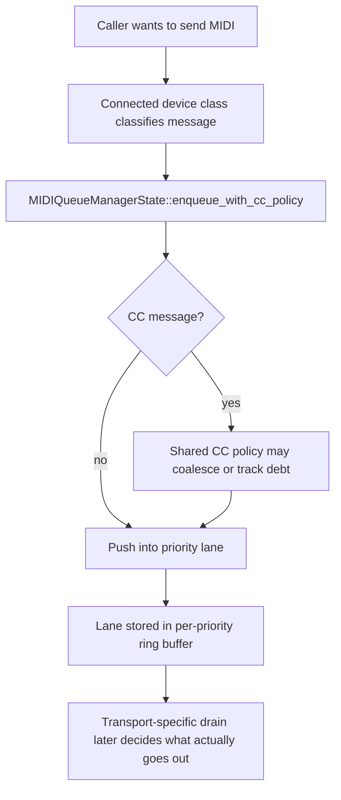
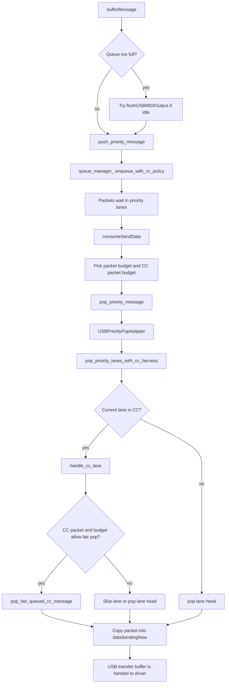
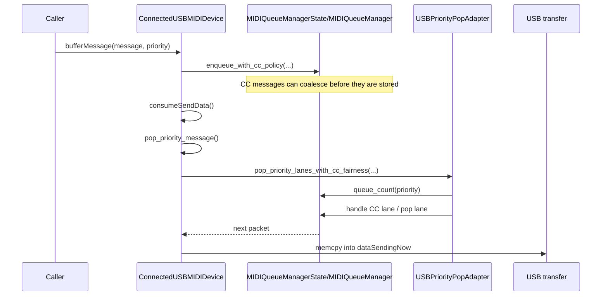
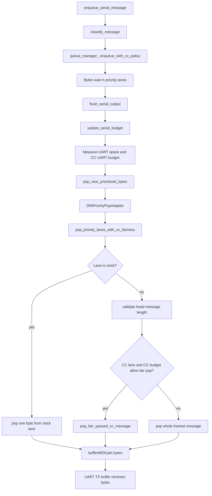
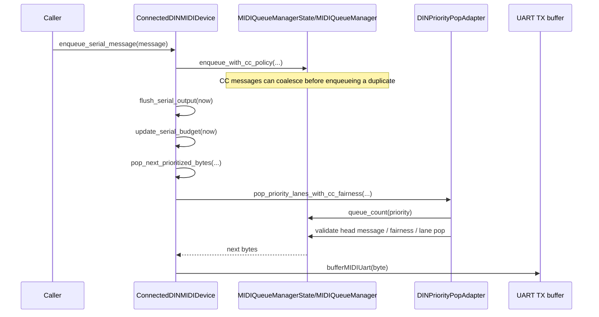
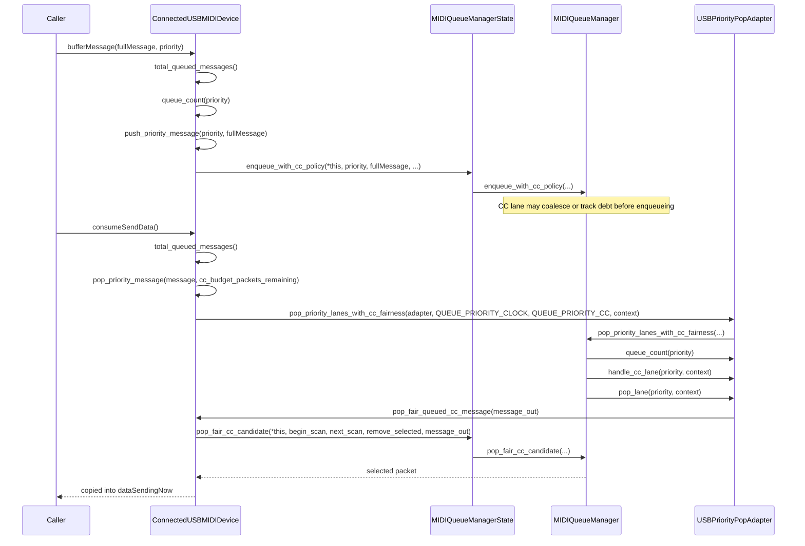
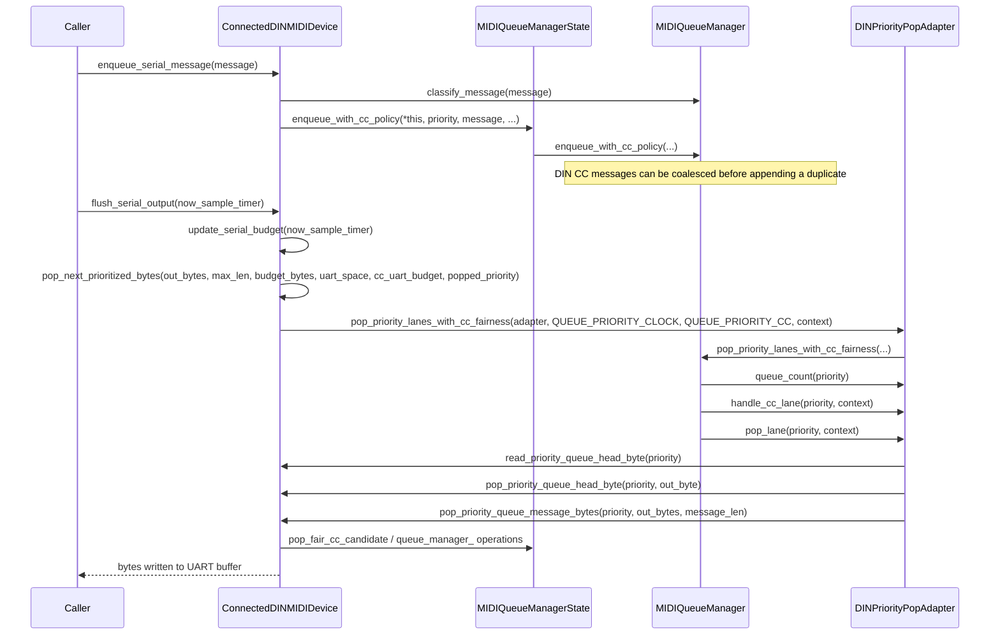

# MIDI Queue Flow

This note explains how MIDI output is queued and drained in the current codebase, with separate diagrams for USB and DIN.

The short version is:

- Both transports enqueue into the shared `MIDIQueueManagerState` / `MIDIQueueManager` policy layer.
- USB drains into 4-byte USB-MIDI packets and assembles a transfer buffer.
- DIN drains into a paced UART byte stream, where clock bytes and framed messages have different pop rules.

## Shared Queuing Model

## USB Flow

USB output is packet-based. Each queued item is a packed 32-bit USB-MIDI event, and the drain code tries to build a short burst of packets for the next transfer.

## DIN Flow

DIN output is byte-based and time-based. The queue still stores messages by priority, but the drain path must respect UART space, pacing budget, and special handling for the realtime clock lane.

## USB vs DIN

| Topic | USB | DIN |
| --- | --- | --- |
| Transport unit | 4-byte USB-MIDI event packet | Raw MIDI bytes |
| Drain trigger | Build a send buffer for the next USB transfer | Fill UART TX buffer while pacing allows |
| Budgeting | CC packet budget during transfer assembly | Q8 time budget plus UART space plus CC UART budget |
| Clock lane | No special byte-level lane handling | Clock lane is byte-oriented and emits one byte at a time |
| Framed messages | Always pop as packed packets | Pop whole messages when the length fits |
| Shared fairness | Same shared CC lane policy and priority traversal | Same shared CC lane policy and priority traversal |

## Reading The Code

If you want to follow this in code, the most useful entry points are:

- [src/deluge/io/midi/midi_device_manager.cpp](../../src/deluge/io/midi/midi_device_manager.cpp)
- [src/deluge/io/midi/midi_queue_manager.h](../../src/deluge/io/midi/midi_queue_manager.h)

The USB side starts at `ConnectedUSBMIDIDevice::bufferMessage()` and drains through `consumeSendData()`.
The DIN side starts at `ConnectedDINMIDIDevice::enqueue_serial_message()` and drains through `flush_serial_output()`.

## Code-Centric Call Chains

This version follows the exact function names and shows the call chain step by step.

### USB Call Chain

### DIN Call Chain

### Step By Step

1. USB starts at `ConnectedUSBMIDIDevice::bufferMessage()` and eventually calls `ConnectedUSBMIDIDevice::consumeSendData()` to assemble the next transfer.
2. DIN starts at `ConnectedDINMIDIDevice::enqueue_serial_message()` and eventually calls `ConnectedDINMIDIDevice::flush_serial_output()` to fill the UART buffer.
3. Both transports enqueue through `MIDIQueueManagerState::enqueue_with_cc_policy()`, which forwards into `MIDIQueueManager::enqueue_with_cc_policy()`.
4. Both transports drain through `MIDIQueueManager::pop_priority_lanes_with_cc_fairness()`.
5. USB uses `USBPriorityPopAdapter::handle_cc_lane()` and `USBPriorityPopAdapter::pop_lane()` to choose between fair CC dequeue and direct head pop.
6. DIN uses `DINPriorityPopAdapter::handle_cc_lane()` and `DINPriorityPopAdapter::pop_lane()` to handle the clock lane, framed messages, and fair CC dequeue.
7. USB ultimately copies packed packets into `dataSendingNow`, while DIN writes byte sequences into the UART TX buffer via `bufferMIDIUart()`.
