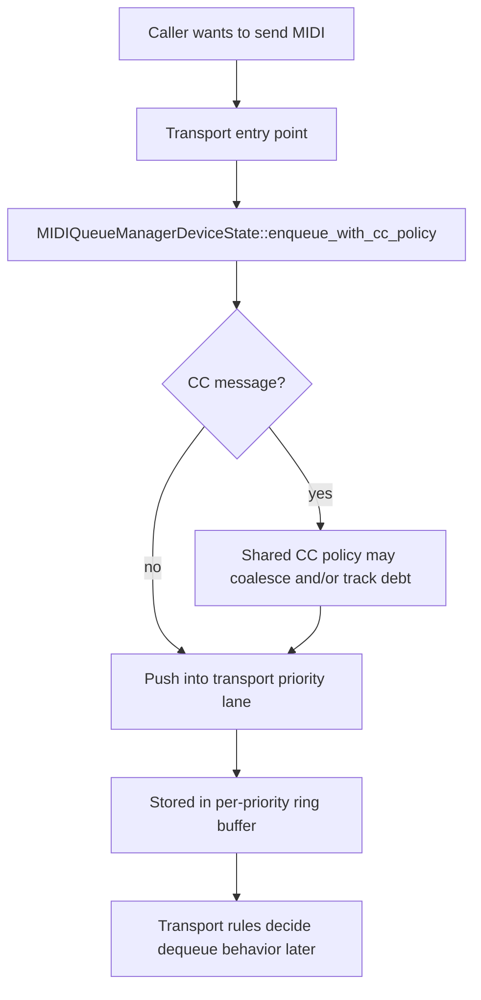
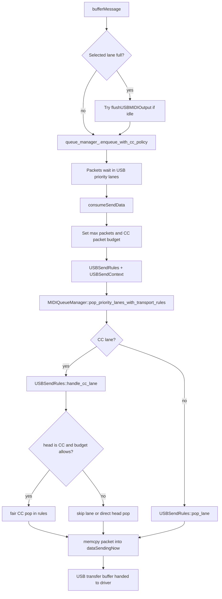
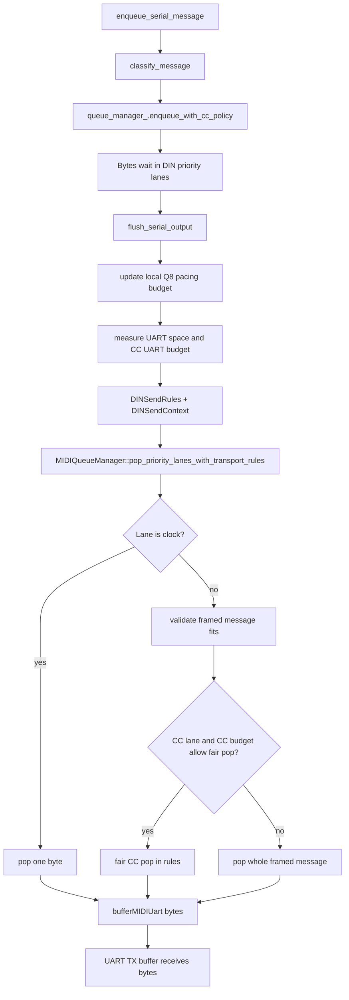
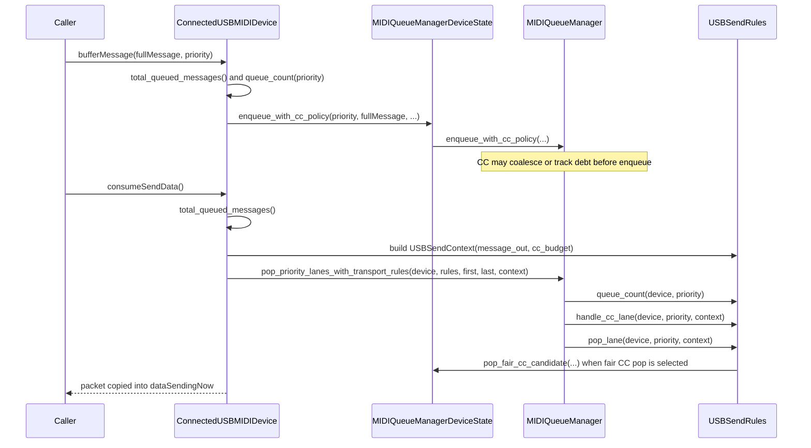
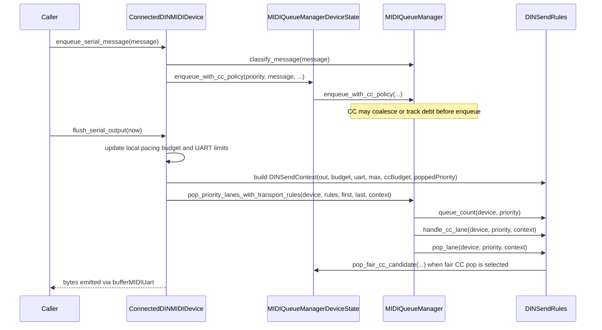

# MIDI Queue Flow

This note explains how MIDI output is queued and drained in the current codebase, with separate diagrams for USB and DIN.

The short version is:

- Both transports enqueue into the shared `MIDIQueueManagerDeviceState` / `MIDIQueueManager` policy layer.
- Both transports drain through the shared traversal API `pop_priority_lanes_with_transport_rules`.
- USB drains packed 32-bit USB-MIDI events into a transfer buffer.
- DIN drains a paced UART byte stream with clock-lane and message-fit constraints.

## Shared Queuing Model

## USB Flow

USB output is packet-based. Each queued item is a packed 32-bit USB-MIDI event.

## DIN Flow

DIN output is byte-based and time-based.

## USB vs DIN

| Topic | USB | DIN |
| --- | --- | --- |
| Transport unit | 4-byte USB-MIDI event packet | Raw MIDI bytes |
| Occupancy check API | `hasBufferedSendData()` (bool), `total_queued_messages()` (count) | `has_serial_data()` (bool) |
| Drain trigger | Build transfer buffer in `consumeSendData()` | Fill UART TX while pacing allows in `flush_serial_output()` |
| Budgeting | CC packet budget during transfer assembly | Q8 pacing budget + UART space + CC UART budget |
| Clock lane handling | No byte-level special lane handling | Clock lane emits one byte at a time |
| Framed-message fit checks | Not needed (already packetized) | Required for non-clock message pop |
| Shared fairness core | Same shared CC fairness + lane traversal | Same shared CC fairness + lane traversal |

## Reading The Code

If you want to follow this in code, the most useful entry points are:

- [src/deluge/io/midi/midi_device_manager.cpp](../../src/deluge/io/midi/midi_device_manager.cpp)
- [src/deluge/io/midi/midi_send_rules.h](../../src/deluge/io/midi/midi_send_rules.h)
- [src/deluge/io/midi/midi_queue_manager.h](../../src/deluge/io/midi/midi_queue_manager.h)

USB starts at `ConnectedUSBMIDIDevice::bufferMessage()` and drains through `consumeSendData()`.
DIN starts at `ConnectedDINMIDIDevice::enqueue_serial_message()` and drains through `flush_serial_output()`.

## Code-Centric Call Chains

### USB Call Chain

### DIN Call Chain

## Step By Step

1. USB starts at `ConnectedUSBMIDIDevice::bufferMessage()` and drains via `consumeSendData()`.
2. DIN starts at `ConnectedDINMIDIDevice::enqueue_serial_message()` and drains via `flush_serial_output()`.
3. Both enqueue through `MIDIQueueManagerDeviceState::enqueue_with_cc_policy()`, forwarding to `MIDIQueueManager::enqueue_with_cc_policy()`.
4. Both dequeue through `MIDIQueueManager::pop_priority_lanes_with_transport_rules()`.
5. Transport-specific behavior lives in `USBSendRules` and `DINSendRules`, including CC-lane fair-pop decisions.
6. Both use shared CC fairness state (`pop_fair_cc_candidate`) but apply different transport constraints (USB packet burst limits vs DIN pacing/UART limits).
